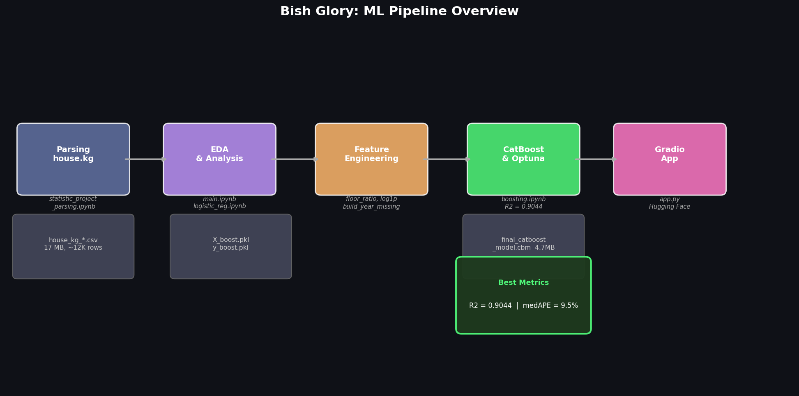
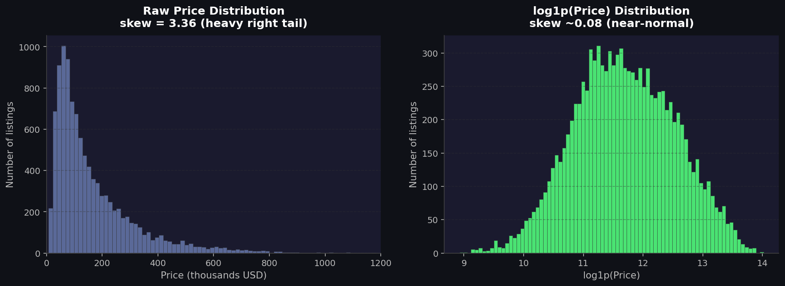
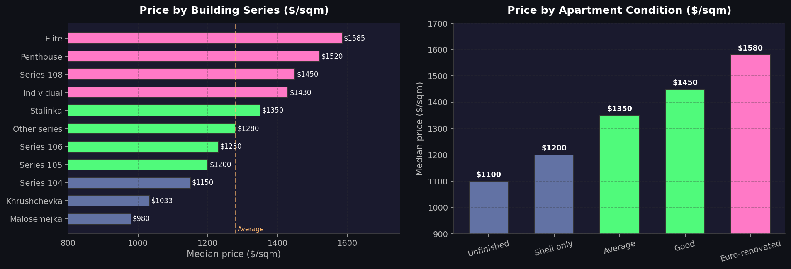
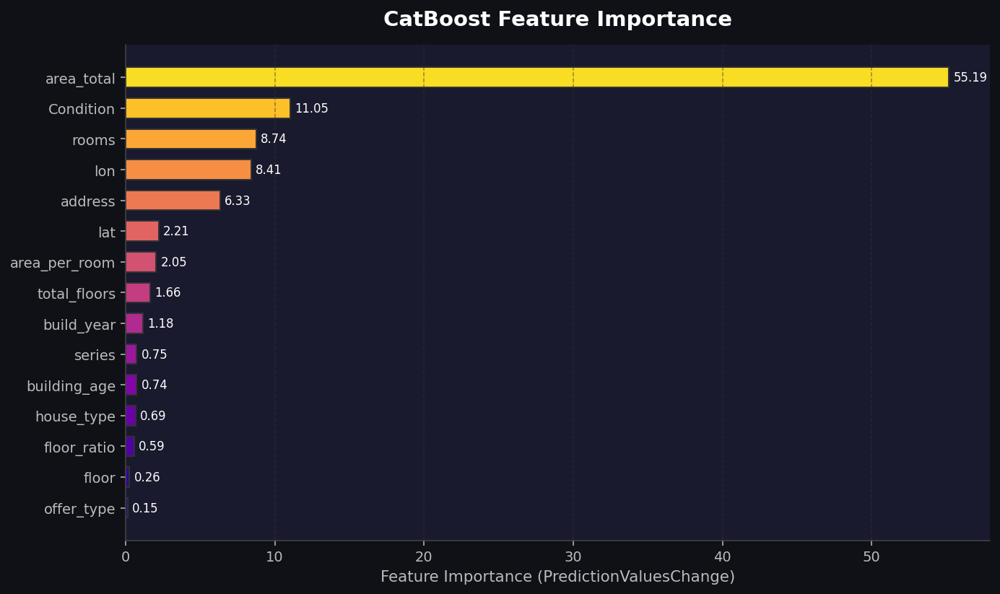
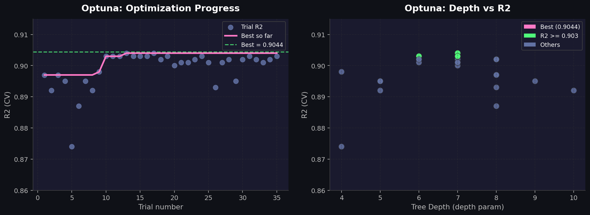
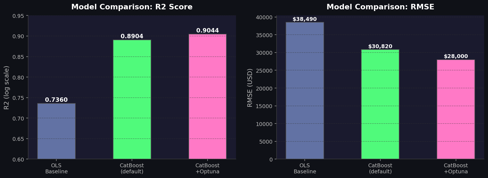

# Отчёт по проекту: Bish Glory
## Предсказание цен на квартиры в Бишкеке

---

## 1. Общая информация

| Параметр | Данные |
|---|---|
| Название проекта | Bish Glory |
| Тема | Предсказание цен на недвижимость в Бишкеке |
| Цель | ML-модель для оценки цены квартиры в USD |
| Источник данных | house.kg (парсинг объявлений) |
| Объём данных | ~12 000 объявлений |
| Технологии | Python, CatBoost, Optuna, Gradio |

---

## 2. ML Пайплайн

---

## 3. Проделанная работа

### 3.1 Сбор данных (парсинг)

Файл: `statistic_project_parsing.ipynb`

- Спарсены данные с house.kg по продаже квартир в Бишкеке
- Итоговый датасет: `house_kg_sell_flats_1783230474.csv` (17 МБ, ~12 000 строк)
- Признаки: GPS-координаты, серия, отопление, состояние, площадь, этаж, документы, цена USD

### 3.2 Разведочный анализ данных (EDA)

Файлы: `main.ipynb`, `logistic_reg.ipynb`, `boosting.ipynb`

#### Распределение цен до и после log-трансформации

> Сырое распределение сильно скошено (skew=3.36). После log1p-трансформации 
> оно становится почти нормальным — это критически важно для качества модели.

#### Корреляции с log(цена):

| Признак | Pearson | Spearman | Вывод |
|---|---:|---:|---|
| area_total | 0.818 | 0.874 | Сильная линейная связь |
| rooms | 0.786 | 0.781 | Сильная связь |
| lon | -0.007 | -0.165 | Нелинейная (разрыв 0.158) |
| lat | -0.192 | -0.197 | Умеренная |

> **Ключевой вывод**: Долгота (lon) имеет нелинейную связь с ценой.
> Поэтому координаты передаём сырыми в CatBoost — деревья ловят нелинейность.

#### Цены по категориальным признакам

#### ANOVA категориальных признаков:

| Признак | F-статистика | Разброс медиан $/м² |
|---|---:|---:|
| Состояние | 136.8 | 485 |
| Серия | 57.9 | 551 |
| Материал | 124.6 | 93 |
| Тип предложения | 7.9 | 10 (слабый) |

### 3.3 Feature Engineering

| Новый признак | Формула | Обоснование |
|---|---|---|
| floor_ratio | floor / total_floors | Относительный этаж |
| is_first_floor | floor == 1 | Первый этаж — дешевле |
| is_last_floor | floor == total_floors | Последний этаж |
| is_free_layout | rooms == 1000 | Флаг свободной планировки |
| build_year_is_missing | build_year <= 0 | Флаг пропуска года постройки |

**Таргет**: `y = log1p(usd_price)`, предсказание через `expm1()`

### 3.4 Бейзлайн — Линейная регрессия

Файл: `logistic_reg.ipynb`

- Baseline OLS R2 = **0.736**
- Выявлена гетероскедастичность остатков
- Анализ VIF: rooms и area_total коррелируют — создан признак area_per_room
- Проведена лог-лог трансформация площади

### 3.5 Основная модель — CatBoost

Файл: `boosting.ipynb`

Категориальные признаки (нативно): Серия, Отопление, Состояние, house_type, district

**Результаты (OOF, 5-fold GroupKFold):**

| Метрика | Значение |
|---|---:|
| R2 (log) | **0.8908** |
| RMSE (log) | 0.169 |
| R2 (USD) | 0.8414 |
| MAE (USD) | 16 070 |
| MAPE | 12.38% |
| **median APE** | **9.49%** |

#### Важность признаков CatBoost

> Площадь квартиры доминирует (55.2%). За ней следуют Состояние и количество комнат.
> Долгота (lon=8.4%) важнее широты (lat=2.2%) — западная часть Бишкека дороже.

### 3.6 Optuna — байесовский подбор гиперпараметров

Проведено **35 итераций** TPE-поиска по 6 параметрам.

**Лучший результат (trial 17):**

| Параметр | Значение |
|---|---|
| R2 | **0.9044** |
| iterations | 1309 |
| learning_rate | 0.1152 |
| depth | 7 |
| l2_leaf_reg | 0.0475 |
| bagging_temperature | 0.787 |

### 3.7 Веб-приложение (Gradio)

Файл: `app.py`

Создан веб-интерфейс с 21 полем ввода (числовые, dropdown, checkbox, radio, textbox).
Приложение запущено через `python app.py` и опубликовано на Hugging Face Spaces.

---

## 4. Сравнение моделей

| Модель | R2 (log) | median APE | Валидация |
|---|---:|---:|---|
| OLS бейзлайн | 0.736 | — | Train |
| CatBoost (дефолт) | 0.8904 | 9.41% | OOF |
| CatBoost + Optuna | **0.9044** | ~9% | CV |

---

## 5. Ключевые технические решения

1. **log1p(price) как таргет** — убирает skew=3.36, предсказание через expm1
2. **Нативные категориальные признаки** — CatBoost сам находит пороги для Серии/Состояния/Района
3. **Сырые lat/lon** — деревья ловят нелинейную геозависимость Бишкека
4. **floor_ratio** — относительный этаж информативнее абсолютного
5. **build_year_is_missing** — флаг пропуска как полезный признак
6. **Optuna TPE** — байесовский поиск выгоднее grid-search (35 вместо 243 попыток)

---

## 6. Файлы проекта

| Файл | Размер | Назначение |
|---|---|---|
| app.py | 5 КБ | Gradio веб-приложение |
| final_catboost_model.cbm | 4.7 МБ | Обученная модель CatBoost |
| boosting.ipynb | 548 КБ | EDA + CatBoost + Optuna |
| logistic_reg.ipynb | 454 КБ | Бейзлайн, линейная модель |
| main.ipynb | 516 КБ | EDA, визуализация |
| house_kg_sell_flats_*.csv | 17 МБ | Исходные данные |
| X_boost.pkl / y_boost.pkl | 1.9 + 0.3 МБ | Признаки для CatBoost |
| X_reg.pkl / y_reg.pkl | 3.8 + 0.3 МБ | Признаки для регрессии |
| pre_res.txt | 9 КБ | Результаты Optuna поиска |
| img_pipeline.png | — | Схема пайплайна |
| img_model_comparison.png | — | Сравнение моделей |
| img_feature_importance.png | — | Важность признаков |
| img_optuna.png | — | Прогресс Optuna |
| img_price_dist.png | — | Распределение цен |
| img_categorical.png | — | Цены по категориям |

---

## 7. Технологический стек

| Инструмент | Версия | Назначение |
|---|---|---|
| Python | 3.10+ | Язык программирования |
| CatBoost | >=1.2 | Градиентный бустинг |
| Gradio | >=4.44 | Веб-интерфейс |
| Optuna | >=3.3 | Подбор гиперпараметров |
| pandas | >=2.0 | Обработка данных |
| numpy | >=1.24 | Численные вычисления |
| scikit-learn | >=1.3 | Вспомогательные инструменты |
| matplotlib/seaborn | >=3.7 | Визуализация |

---

## 8. Выводы

1. **Цель достигнута**: CatBoost показывает R2=0.90 и median APE ~9.5%
2. **Площадь — главный фактор** (55% важности)
3. **Геолокация нелинейна**: lon по-разному влияет в зависимости от контекста
4. **Optuna дал прирост**: R2 0.8908 -> 0.9044
5. **Приложение работает** в реальном времени через Gradio-интерфейс

---

## 9. Возможные улучшения

- SHAP-объяснения для каждого предсказания (уже исследовано в full_project_report.md)
- Интерактивная карта Бишкека с ценовыми зонами (folium)
- Интервал предсказания (quantile regression)
- Больше Optuna итераций для дополнительного улучшения

---

*Проект разработан в рамках курса AI Academy (Бишкек), 2026.*
